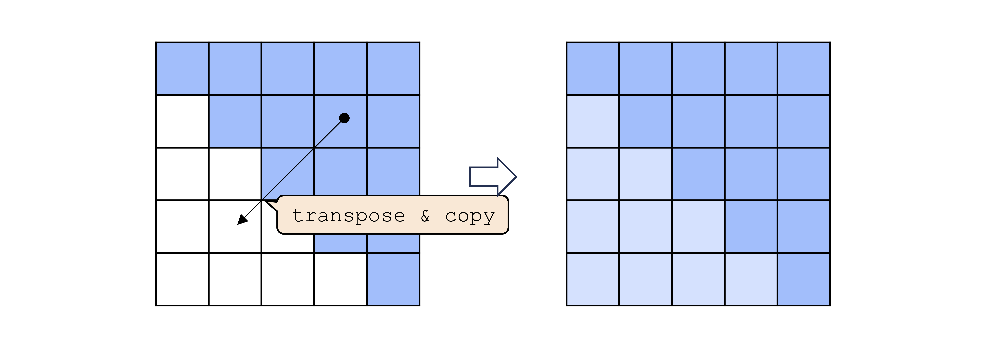

# Flash-Muon: An Efficient Implementation of Muon Optimizer
This repo implements an efficient version of Muon optimizer through a customized CUDA kernel for (large-dim) matmuls in Newton-Schulz iterations.


## Installation

```sh
git clone https://github.com/nil0x9/flash-muon.git

pip install -e ./
```

> **Note**: The current CUDA implementation remains suboptimally tuned for the latest hardware architectures. To maximize compatibility with modern devices, we have implemented an equivalent version using [triton-lang](https://github.com/triton-lang/triton) and make it default implementation. The original CUDA version could still be found in `cuda_dev` branch (we'll keep working on it).


## Usage

The usage is actually identical to the [original Muon implementation](https://github.com/KellerJordan/Muon/tree/master) as the python API was adapted from there.

```python
from flash_muon import Muon

# Find ≥2D parameters in the body of the network -- these should be optimized by Muon
muon_params = [p for p in model.body.parameters() if p.ndim >= 2]
# Find everything else -- these should be optimized by AdamW
adamw_params = ([p for p in model.body.parameters() if p.ndim < 2]
              + [*model.head.parameters(), *model.embed.parameters()])
# Create the optimizer
optimizers = [Muon(muon_params, lr=0.02, momentum=0.95, rank=0, world_size=1),
              torch.optim.AdamW(adamw_params, lr=3e-4, betas=(0.90, 0.95), weight_decay=0.01)]
...

# in the training step
for opt in optimizers:
    opt.step()
```

In case anyone wants to cook their own optimizer, we also expose the following APIs:

- `fast_newtonschulz(torch.Tensor x, int steps)`: The Newton-Schulz iteration as used in Muon, with symmetric matmul's replaced with our faster version.
- `matmul_transpose(torch.Tensor x)`: The core function used to compute `x@x.T` fast.
- `matmul_transpose_assign(torch.Tensor x, torch.Tensor y)`: The same functionality as above but copies the result to the second argument Tensor instead of creating and return a new one.


## How it works

The core of Muon is  Newton-Schulz iterations, which involves the calcultion of a "matrix polynomial" of the (normalized) gradient matrix:

$$
X\leftarrow aX + b(XX^\top)X + c(XX^\top)(XX^\top)X
$$

In [Jordan's implementation](https://github.com/KellerJordan/Muon/tree/master) this iteration is implemented with the following lines of codes:

```python
for _ in range(steps):
    A = X @ X.T
    B = b * A + c * A @ A
    X = a * X + B @ X
```

Note that with $A=XX^\top$, which is symetrical，we have $AA = AA^\top$. Say if we can implement an algorithm that calculate `lambda x: matmul(x, x.T)` faster than the native `matmul` op, then we can naturally boost the Newton-Schulz iterations to make Muon faster!

The intuition is very simple - We only calculate upper triangular parts of the result, and then transpose and copy each result tiles to the corresponding lower triangular parts. We do this by early exiting by block index (`blockIdx.x > blockIdx.y`) and a transpose-copy from register to global memory at the epilogue of the GEMM kernel. This is illustrated as follows:



This design effectively saves almost half the computation in GEMM (depending on the size of the matrix).


We test the compute time of `matmul_transpose` as well as the adapted Newton-Schulz iteration throughout different devices. 


We list the detailed benchmark result (ms) for `matmul_transpose` as follows:
| device | dim  | flash  | torch  | compiled |
|--------|------|--------|--------|----------------|
| H800 | 1024 | 0.0124 | 0.0112 | 0.0107 |
| H800 | 2048 | 0.0322 | 0.0384 | 0.0384 |
| H800 | 4096 | 0.1838 | 0.2955 | 0.3000 |
| H800 | 8192 | 1.4528 | 2.2643 | 2.2804 |
| H20 | 1024 | 0.0164 | 0.0275 | 0.0275 |
| H20 | 2048 | 0.0746 | 0.1588 | 0.1587 |
| H20 | 4096 | 0.5068 | 1.0431 | 1.0431 |
| H20 | 8192 | 3.9265 | 7.9691 | 7.9508 |
| A100 | 1024 | 0.0191 | 0.0228 | 0.0232 |
| A100 | 2048 | 0.0689 | 0.1166 | 0.1164 |
| A100 | 4096 | 0.3733 | 0.6644 | 0.6649 |
| A100 | 8192 | 2.9815 | 5.1604 | 5.2858 |
| 4090 | 1024 | 0.0208 | 0.0213 | 0.0208 |
| 4090 | 2048 | 0.0823 | 0.1098 | 0.1095 |
| 4090 | 4096 | 0.5249 | 0.8535 | 0.8546 |
| 4090 | 8192 | 3.5689 | 6.7631 | 6.7869 |


## Acknowledgement

The idea of boosting Muon by customizing a CUDA kernel for `matmul(x, x.T)` was originally proposed by Laker Newhouse et al. in [this writing](https://www.lakernewhouse.com/assets/writing/faster-symmul-with-thunderkittens.pdf). However, they mention that their kernel "has incorrect behavior in the transpose-and-store step". We take the idea further and implement our own version of the kernel.

The [CUDA code](https://github.com/nil0x9/flash-muon/blob/cuda_dev/csrc/matmul_transpose.cu) was adapted from GEMM codes provided by [DD-DuDa](https://github.com/DD-DuDa) and the Muon code was adapted from [Jordan's implementation](https://github.com/KellerJordan/Muon/tree/master).


## Citation
```
@misc{lin2025flash,
  author       = {Tianyang Lin},
  title        = {Flash-Muon: An Efficient Implementation of Muon Optimizer},
  year         = {2025},
  url          = {https://github.com/nil0x9/flash-muon}
}
```
